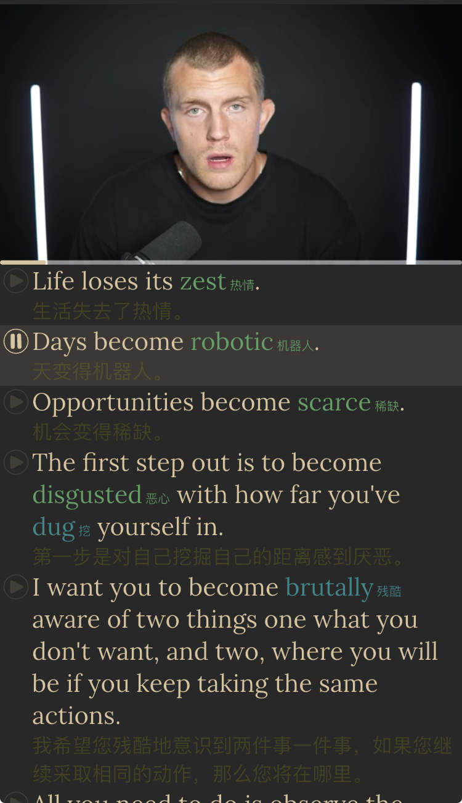
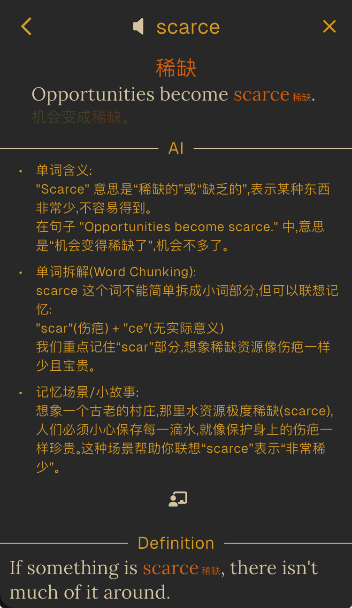

# 英语必成术

## 前言

语言学习像玄学: 多年努力, 不见成效.  
成功者秘诀: "兴趣驱动, 坚持努力, 敢于犯错."  
不得要领的照做进步甚微, 看别人突飞猛进, 黯然认为自身没有语言天赋/年纪太大.  
错!  
能掌握母语, 就有语言天赋.  
成人比幼儿有更大优势.

## 诀窍: 术和道

成功者: 英语歌听多/英语游戏玩多/英文小说读多/国际尬聊多, 玩乐享受中不知不觉掌握了英语.  
有将字典硬背下来多年苦学成功的; 也有认真跟学学校课程而成的.

> 兴趣和动力是核心, 苦学和坚持也能成功.

这是正确的废话.  
找不到能沉迷的英语事物, 羡慕靠痴迷玩乐无痛苦掌握的人; 佩服苦学而成的坚韧者.  
缺乏热情兴趣无法痴迷也吃不了苦的自己看来无缘英语.

---

成功者只阐述了*道*, 自身碰巧执行了正确的*术*实现了*道*, 未能总结行之有效的*术*.  
本文专注在*术*: 执行正确方法/任务, 必然能掌握英语.

## 准备工作: 工具和素材

### EnTube

`English Tube` 是配合执行*术*而开发的 APP, 可以将任意 YouTube 视频导入作为学习素材, 提供了翻译/ AI 等配套辅助工具执行本*术*.

### 素材

选择满足下列条件的素材:

- 感兴趣愿意听多遍
- 难度匹配自身水平
- 成系列有足够多内容
- 固定主角, 便于更快听懂
- 对话/讲述/演讲为主, 内容密集有主题/故事, 避免空洞教学英语,
- 5-20 分钟时长
- ~~有精准人工字幕~~ [^subtitle]

首篇素材优劣, 决定了本方法能否成功执行, 慎选! 慎选!  
推荐[Dan Koe](https://www.youtube.com/@DanKoeTalks)的这一集:

<a href="https://www.youtube.com/watch?v=CzSmZvTYvME" target="_blank">
  

    The Fastest Way To Change Your Life (Starting Right Now)
    </img>
  

</a>

将链接添加到 EnTube 播放学习.  
励志6分钟短文, 适合首篇, 后续可以继续用同系列较短视频:

- [How To Hard Reset Your Life (In 30 Minutes)](https://www.youtube.com/watch?v=R5wx9gw-9lE)
- [How To Get Ahead Of 99% Of People (In 6-12 Months)](https://www.youtube.com/watch?v=d5RKW3WSEb0)
- [Your Future Will Be Determined By 3 Things](https://www.youtube.com/watch?v=fcE9-dQyclc)
- [How To Do Whatever The F\*ck You Want](https://www.youtube.com/watch?v=5qVOgUlbDM0)
- [Your 20s Are Meant To Build (How To Not Waste Them)](https://www.youtube.com/watch?v=2Q0RGjYCkq4)
- [Disappear And Come Back Unrecognizable (12 Rules To Change Your Life)](https://www.youtube.com/watch?v=reLmDf_PIvI)

栏目有很多用词复杂时长长的视频, 能力提高后, 可以自行取用.  
如果难度不合适, 也有其他优质频道:

- [Better Ideas](https://www.youtube.com/@betterideas)
- [Andrei Jikh](https://www.youtube.com/@AndreiJikh)
- [Johnny Harris](https://www.youtube.com/@johnnyharris)
- [Where's Wes?](https://www.youtube.com/@WheresWes)
- [What I've Learned](https://www.youtube.com/@WhatIveLearned)

也可自行选用 [YouTube](https://www.youtube.com/) 上的任意视频, 但要贴合自身情况.

### 阶段一: 跟听看懂

`EnTube` 中逐句听看字幕文章, 整句翻译用了低对比色, 利于忽略.

单词点击后可显示解释, AI 分析助记, 词源定义等内容.

为避免打断阅读, 可关闭**显示单词详情**功能, 只看注脚翻译.

反复的逐句听看, 达成任务:

1. 点击高亮不认识不熟悉的单词
2. 理解句子
3. 看懂整篇文章

在极限内重复执行, 细扣熟悉每个单词/短语在句中用法.  
Dan Koe 使用正常语速, 会出现无法跟上的情况; 不要改用慢速素材或者降低播放速度, 可暂停播放单纯阅读, 直至熟悉文字后再听看, 要从开始就熟悉母语者正常语速.

有顽固单词始终无法记住, 可开启**显示单词详情**功能, 仔细学习单词详情, 认真熟悉.

6分钟的内容每天4小时以上, 花费一周很正常, 严禁图快和欺骗自己.  
可以关闭**单词翻译**和**整句翻译**功能, 继续重复听看, 避免出现以为会了的情况, 直至牢固扎实的掌握了通篇细节.

别听信不学单词直接记短语和句子的谣言, 利用**显示单词详情**牢牢记住单词, 在这基础上才能掌握短语和句子.  
重复中, 可以长按已经掌握单词取消高亮, 便于集中攻克未掌握单词, 直至通篇熟悉和掌握.

PS: 推荐素材的句子并不简单直白, 理解起来是有难度的, 整句翻译也有偏差错误, 感觉不适合初学者; 这是为了在枯燥的重复中享受逐步破解理解的成就感, 耐住性子从单词->短语->句子->整篇逐层牢固理解掌握.

切忌添加其他素材同步学习, 必须咬牙坚持死磕熟悉这一篇, 切记!切记!

### 阶段二: 听懂细节

面对屏幕, 闭眼聆听.

发现识别模糊的音, 立马睁眼定位并确认.

- 会有简单熟悉的单词无法听音识别, 毫不犹豫的点击高亮确认
- 会发现不熟悉的单词用法, 点击并确认, 用 AI 辅助理解

### 阶段三: 流利跟读

### 阶段四: 脱口而出

[^subtitle]: 人工字幕有准确断句, 单词翻译会结合整句上下文针对多义词提供更精准的翻译; YouTube 升级了语音 AI 识别功能, 新自动生成字幕可以断句, 因此不必再刻意限定人工字幕
